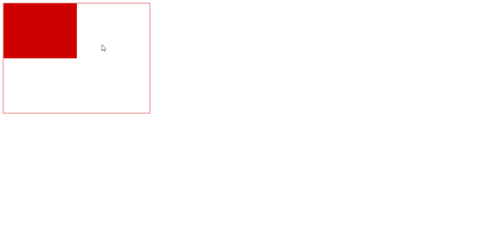

##学习svg，绘制藤蔓动画  

*1* [SVG SMIL animation概览](http://www.zhangxinxu.com/wordpress/2014/08/so-powerful-svg-smil-animation/)

* set：可以在特定时间之后修改某个属性值（也可以是CSS属性值）。
* animate
* animateColor
* animateTransform
* animateMotion

###### 要想前端有所成，有两条路，一是往前，webGL,   canvas, SVG领域，这需要对图形敏感，有设计感，有动画素养，有相当的数学知识，以及最重要的JavaScript控制能力

[svg path贝塞尔曲线](http://www.zhangxinxu.com/wordpress/2014/06/deep-understand-svg-path-bezier-curves-command/)

######Warning: SVG's SMIL animations (<animate>, <set>, etc.) are deprecated and will be removed. Please use CSS animations or Web animations instead.

#####excuse me ? 弃用了？！
[不弃疗就好](http://tgideas.qq.com/webplat/info/news_version3/804/7104/7106/m5723/201610/514918.shtml)

[史诗级动画smil](https://css-tricks.com/guide-svg-animations-smil/)

*2* svg元素

    <svg width="1200" height="520" xmlns="http://www.w3.org/2000/svg">
    </svg>

    //ai自动生成的<svg>
    <svg 
        version="1.1" 
        id="Layer_1" 
        xmlns="http://www.w3.org/2000/svg" 
        xmlns:xlink="http://www.w3.org/1999/xlink" 
        x="0px" 
        y="0px"
        width="600px" 
        height="850px" 
        viewBox="0 0 600 850" 
        xml:space="preserve">
    </svg>

*3* g元素：容器元素，组合相关的图形元素,支持多重嵌套

*4* 矩形元素 rect

    <rect y="3" fill-rule="evenodd" clip-rule="evenodd" fill="#B8CD30" width="1366" height="768"/>

*5* 圆 circle
        
        //不用加上单位px
        <circle cx="80" cy="80" r="10"/>

*6* 椭圆 ellipse
    
        <circle cx="80" cy="80" rx="10" ry="50"/>

*7* 折线 polyine

        <polyline fill-rule="evenodd" clip-rule="evenodd" fill="none" stroke="#D64947" stroke-miterlimit="10" 
        points="
            0.346,4.517  4.177,8.183 1.429,12.517 12.013,13.017 7.263,16.767 4.92,18.683 13.596,19.35 17.846,14.1 17.346,7.517 4.177,4.85 8.596,0.35 "/>

*8* 多边形 polygon

        <polygon fill-rule="evenodd" clip-rule="evenodd" fill="#D64947"     
            points="2.845,9.853 0,4.927 2.845,0 8.533,0 11.377,4.927 
    8.533,9.853 "/>

*9* fill-rule="evenodd" [填充法则：](http://blog.csdn.net/cuixiping/article/details/7848369)

*10* path:路径 

    <path d="M10 10 C 20 20, 40 20, 50 10" stroke="black" fill="transparent"/>
   
   //一组字符串，由绘图指令和坐标数据构成。  d="path data" 

    m   moveto  移动到 (x y)+
    Z   closepath  关闭路径 (none)
    L   lineto  画线到 (x y)+
    H   horizontal lineto  水平线到 x+
    V   vertical lineto  垂直线到   y+
    C   curveto  三次贝塞尔曲线到   (x1 y1 x2 y2 x y)+
    S   smooth curveto  光滑三次贝塞尔曲线到  (x2 y2 x y)+
    Q   quadratic Bézier curveto  二次贝塞尔曲线到  (x1 y1 x y)+
    T   smooth quadratic Bézier curveto  光滑二次贝塞尔曲线到 (x y)+
    A   elliptical arc  椭圆弧 (rx ry x-axis-rotation large-arc-flag sweep-flag x y)+
    R   Catmull-Rom curveto*  Catmull-Rom曲线

*10* viewport: 视口 

        <svg 
            version="1.1" 
            id="Layer_1" 
            xmlns="http://www.w3.org/2000/svg" 
            xmlns:xlink="http://www.w3.org/1999/xlink" 
            x="0px" 
            y="0px"
          
            width="600px" 
            height="850px" 
            viewBox="0 0 600 850" 
            xml:space="preserve">
        </svg>

*   width/height决定视口宽高；
*   width/height如果是纯数字，使用的就是“像素”作为单位的；
*   视口初始化后，视口坐标系和用户坐标系一致

*11* viewBox属性：重新定义视口的坐标范围。
        
    viewBox="x, y, width, height"  
    // x:左上角横坐标，y:左上角纵坐标，width:宽度，height:高度

*11.1* SVG就像是我们的显示器屏幕，viewBox就是截屏工具选中的那个框框，最终的呈现就是把框框中的截屏内容再次在显示器中全屏显示！

[福利动图超级好理解](http://www.zhangxinxu.com/wordpress/2014/08/svg-viewport-viewbox-preserveaspectratio/)

*11.2* viewBox大于svg视口的时候，会对应缩放至视口大小，绘制图形。
    
    <svg width="400" height="300" viewBox="0,0,4000,3000" style="border:1px solid #cd0000;">
        <rect x="10" y="5" width="2000" height="1500" fill="#cd0000"/>
    </svg>

 4000/400 = 10 
 最后绘制到视口的图形也是缩放了10倍的图形。
 10/10 = 1px , 5/10 = 0.5px 
    

*12* preserveAspectRatio：解决SVG的宽高比和viewBox的宽高比不一样的情况
    
        preserveAspectRatio="xMidYMid meet"

*12.1* xMidYMid: viewBox如何与SVG viewport对齐；
        
    xMin    viewport和viewBox左边对齐
    xMid    viewport和viewBox x轴中心对齐
    xMax    viewport和viewBox右边对齐
    YMin    viewport和viewBox上边缘对齐。注意Y是大写。
    YMid    viewport和viewBox y轴中心点对齐。注意Y是大写。
    YMax    viewport和viewBox下边缘对齐。注意Y是大写。

    xMaxYMax  //右下

    xMidYMid  //中中对齐

*12.2* meet: 第2个值表示，如何维持高宽比（如果有）
    

        meet    保持纵横比缩放viewBox适应viewport，受
        slice   保持纵横比同时比例小的方向放大填满viewport，攻
        none    扭曲纵横比以充分适应viewport，变态