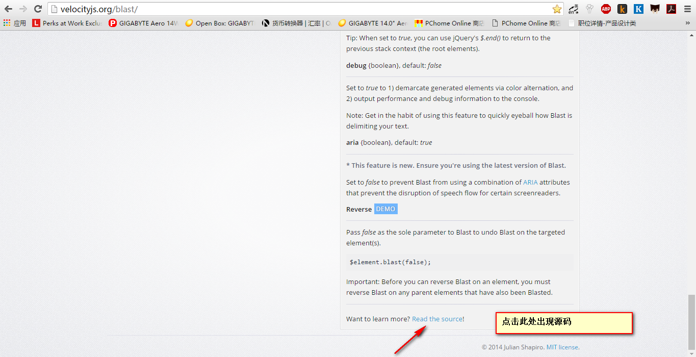
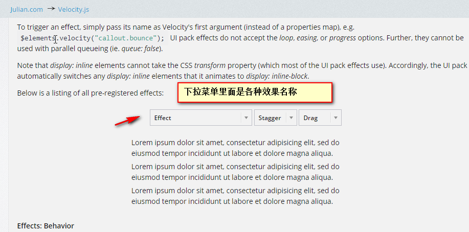

#### 终于可以运行了！！！ 
#### 普天同庆！！！
####  终于找到网址了 [blast](http://velocityjs.org/blast/)
###### 点击read the source! 

###### finalblast.js , jquery.blast.js直接可用

#### 5 blast 文本动画

*1* blast：拆分文本节点，不拆元素

*2* 分隔符： delimiter   将文本节点以character/letter, word, sentence的不同形式进行拆分。

    $("p").blast({ delimiter:"letter"});

*3* 选项：customClass 自定义类 customClass

    $("p").blast({ delimiter:"word", customClass:"myClass" });
    //拆分之后
    to

*4*  生成值类：generateValueClass：接受布尔值用来表示是否要添加到一个特有的类到生成的文本元素上。

###### 特有的类：命名方式  .blast-[delimiter]-[textValue]形式。textValue是对应的文本内容。
###### 该项针对character和word分隔符

###### generateValueClass和customClass不能并存

    $("p").blast({ delimiter:"word", generateValueClass: true});
    //显示成果
    Refresh

###### 可以具体遍历某个单词，对其添加样式

*5* tag标签：指定包装文本部分的元素的类型 默认值：span
    
    //默认情况
    Refresh
    this

    //可以修改 a,div,p, strong这些不同的标签
    $("p").blast({ delimiter:"word", generateValueClass: true, tag: "div"});
    //修改效果如下
    
Refresh

    
this

*6* 反转 ：reverse 即在一个元素上反向执行blast，让拆分的文本恢复成之前的状态

    $("div").blast(false);

    //抵消之前的效果，适用于文字动画结束后恢复原状便于浏览器解析

*7* 动画，过渡进入或者离开视图

    //文件渐进效果
    $("#test").html("春眠不觉晓").blast({ delimiter: "word"}).css("opacity", 0).velocity({ opacity: 1},{duration:3000,delay:2000});

###### 注意： blast往jquery选择器链上返回的是生成文本包装器元素： 这里是span
    //类似如下
    $("span").css("opacity", 0).velocity({ opacity: 1},{duration:3000,delay:2000});

*8* 文字动画序列实现效果 ，错开动画！！！

###### 结合Ui pack 的 stagger选项（规定以ms为单位的一段时间）

    $("#test").html("瑞雪兆丰年！").blast({ delimiter: "letter"}).css("opacity", 0).velocity("transition.shrinkIn",{ stagger:50 });

    //letter的效果比较好，word的效果就是一个缩放！悟了，瑞雪兆丰年就是一个word啊啊啊

*9* 针对中文啊 
    
    letter:是一个字；  word：瑞雪兆丰年，春来发几枝！（嗯，还识别不了逗号）

*10* 渐进渐出再渐进
    
        var message = "瑞雪兆丰年，雷雨发庄稼！";

        //渐进，50ms一个字
        $("#test").html(message)
        .blast({ delimiter: "letter"})
        //css也可以这样写css("属性名"，属性值)
        .css("opacity", 0)
        .velocity("transition.shrinkIn",{ stagger:50 });

        //渐出，从倒数第一个开始
        $("#test .blast").velocity( "transition.fadeOut", {
          stagger: 500,
          backwards: true,
          complete: function(){
            //渐进，从第一个开始
            $("#test").html(message)
            .blast({ delimiter: "letter"}).css("opacity", 0).velocity("transition.shrinkIn", { stagger: 500});
          }
        })

###### backwards: 与stragger选项搭配使用反转目标元素的顺序！

*10* 过渡单个文本 css的nth-child选择器或者 jquery的eq()函数。

###### 基于元素的索引值来选择某个元素
    //css

    .blast:nth-child(3) {
        color: red;
    }

    //jquery  eq(0)索引从0开始
    $(".blast").eq(2).css("color","red");

*11* UIpack 效果！

*12* UIpack 效果中有用到3D变化的（rotateX，rotateY，translateZ）,display:inline的元素不能用。所以要自己在css上设置为 display:inline-block;

    $("#test .blast").velocity( "transition.perspectiveDownOut", {
      stagger: 500,
      backwards: true,
      complete: function(){
        $("#test").html(message)
        .blast({ delimiter: "letter"})
        //css也可以这样写css({属性名:属性值})
        .css({opacity: 0, display: "inline-block"})
        .velocity("transition.perspectiveDownIn", { stagger: 500});
      }
    })

*13* 文字装饰：形式要服从功能
    
    //遍历透明度啊，调整颜色值
    $("#hello").blast({delimiter:"letter"}).each(function(i,element){
      var adjustedOpacity = 1 - i/10;
      element.style.opacity = adjustedOpacity;
      var adjustedBlue = i*20;
      element.style.opacity = "rgb(0,0,"+adjustedBlue+")";
    });